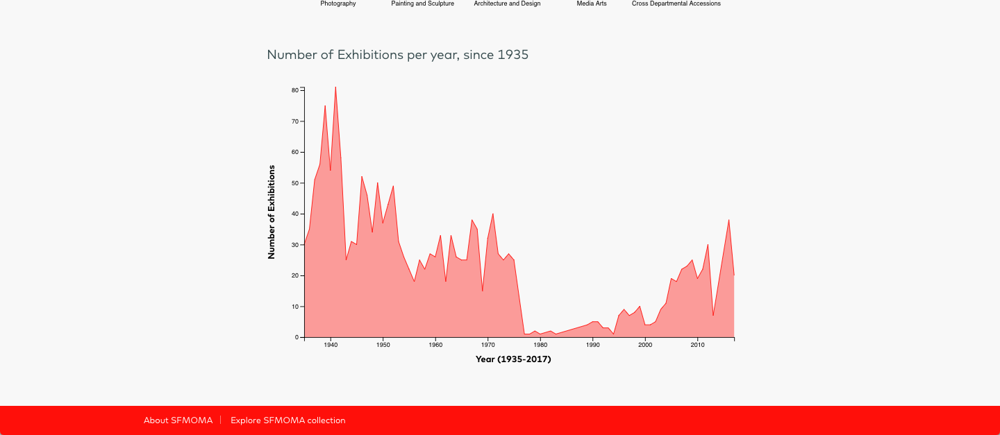

SFMOMA API Metadata Dashboard
==================

## About

SFMOMA API Metadata Dashboard displays the collection metadata overview information such as the completeness and specifics information. The data visualization is done using D3.js Library. Also, the API query and data processing is done in PHP.

The links to the original repo and website will become available soon!

[Check out current website](https://khanhngg.github.io/collection-dashboard/index.html)

## Usage

1. Download or clone the repo
3. `cd collection-dashboard`
3. `python -m SimpleHTTPServer`
4. (Optional) Run scripts to query the API and update collection json

## Screenshots

